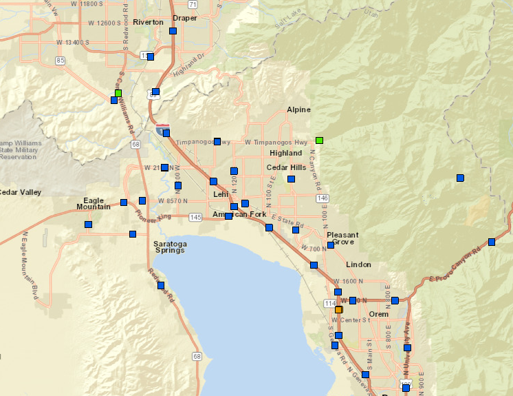
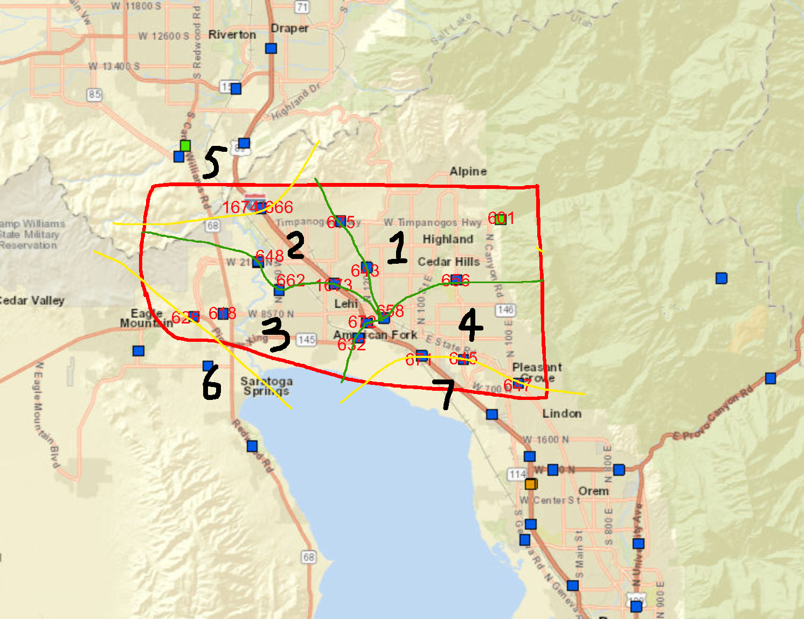

# MATH-4704 MarkovTraffic

本仓库是 SJTU MATH-4704 随机过程的课程项目.
研究名称: __使用马尔科夫过程建模美国犹他州Lehi地区的交通流__

## 研究区域示意图

研究区域道路交通图

  </a>

研究区域分区建模图

  </a>

### 建模方法

使用连续 / 离散 时齐 / 非时齐 马尔科夫链建模Lehi地区的交通流.

根据建模结果, 可以预测未来的交通流量, 及时调整交通流量, 进行管控, 方便城市交通管理, 城市交通建设.

## 数据来源

### vehicles / per person
https://en.wikipedia.org/wiki/List_of_U.S._states_by_vehicles_per_capita
Utah 的人均车辆数量数据来源

### population
Salt Lake City Population https://datacommons.org/place/geoId/4967000?utm_medium=explore&mprop=count&popt=Person&hl=en
https://www2.census.gov/programs-surveys/popest/tables
https://datacommons.org/place/geoId/4944320

#### population of Lehi
Lehi的差不多是 2区和3区的重叠
人口 2022: 84373

Highland 差不多是 1区的重叠
19,902

American Fork + Pleasant Grove 差不多是 4区的重叠
American Fork 人口 2022: 37,268
Pleasant Grove 人口 2022: 37,630

5区: Heber City 人口 2022: 17,865
5区相对比较远, 所以转移应该会比较少.

6区: Bluffdale : 19080
Herriman:  59,179 
Draper:  50,731

7区: Eagle Moutain 54,149 

8区: Lindon 11,704 
Orem 95,910 
Vineyard  14,535

### 交通数据

Utah官网:
https://udot.utah.gov/connect/business/traffic-data/traffic-statistics/
https://drive.google.com/drive/folders/1ZYy-WkICLOp1482vwEbTc5UvLItbWs4y

### 拓扑数据

节点之间的拓扑序的位置
https://hub.arcgis.com/datasets/017ab39594bc4e37964884ac31e8bff4/explore?location=37.731961%2C-112.725309%2C6.42

## future work

本次实验提出了一种基于区域之间交通流量来对交通运输进行分析的方法.

理想的建模情况应该基于街道来作为state, 相应的数据的采集可以由监控摄像头来进行采集, 但因为数据的保密性, 本次实验只能建模在较高维度的区域上, 因此我们只能建模到区域之间的交通流量.

要证明交通中的稳态基本上是没有意义的, 因为交通的昼夜时效性较强, 

但是在较短的时间内部计算还是有意义的.

用 2023 年的数据来进行建模, 当前缺失了部分数据, 就忽略不计了, 
还有部分收费站的数据, 有相应的数据, 但是数据本身也有缺陷, 例如只有某些时间的数据, 这应该代表只有对应的时间开放相应的道路.